  

  
  
  
  

  

 

## About

I build end-to-end web products — from interface and motion to backend logic, integrations, and launch. Over **7 years** and **40+ projects**, I've shipped everything from landing pages to complex SaaS platforms.

What sets me apart: I integrate **AI into products** (Claude, GPT, Gemini via API), build **Telegram bots with payments and CRM**, and deliver **full-stack platforms** with clean code and fast performance.

 

 

## What I Do

<table>
  <tr>
    <td width="33%" valign="top">
      <h3 align="center">Web Platforms</h3>
      
Websites, online stores, dashboards, landing pages. Responsive interfaces that look sharp and perform fast on any device.

      

        
        
        
        
      

    </td>
    <td width="33%" valign="top">
      <h3 align="center">AI Integration</h3>
      
Embedding language models into business workflows. Smart assistants, content generation, and AI-powered interfaces via API.

      

        
        
        
        
      

    </td>
    <td width="33%" valign="top">
      <h3 align="center">Telegram Bots</h3>
      
Bots with built-in payments (Telegram Pay, Stripe, YooKassa), CRM integration, notifications, and FSM logic.

      

        
        
        
        
      

    </td>
  </tr>
</table>

 

 

## Tech Stack

<table>
  <tr>
    <td valign="top" width="50%">

**Frontend**

**Backend**

  </td>
    <td valign="top" width="50%">

**Databases**

**AI & LLM**

**DevOps & Tools**

**Payments**

  </td>
  </tr>
</table>

 

 

## Featured Projects

<table>
  <tr>
    <td width="50%" valign="top">
      <h3 align="center"><a href="https://rupmdg.com">RU PMDG</a></h3>
      
Corporate website for a pharmaceutical company with dynamic content, admin panel, and SEO optimization.

      

        
        
        
        
      

    </td>
    <td width="50%" valign="top">
      <h3 align="center"><a href="https://daminov.net">Portfolio</a></h3>
      
Personal website with 3D scenes, physics-based interactions, AI chat assistant, and multilingual support.

      

        
        
        
        
      

    </td>
  </tr>
  <tr>
    <td width="50%" valign="top">
      <h3 align="center">AI Control Center</h3>
      
Management dashboard for multiple AI models — monitoring, prompt engineering, and usage analytics.

      

        
        
        
        
      

    </td>
    <td width="50%" valign="top">
      <h3 align="center">E-Commerce Platform</h3>
      
Full-stack online store with payment processing, inventory management, and real-time order tracking.

      

        
        
        
        
      

    </td>
  </tr>
  <tr>
    <td width="50%" valign="top">
      <h3 align="center">SEHRIYO Bot</h3>
      
Telegram bot for a residential complex — apartment selection, booking, payments, and admin notifications via FSM.

      

        
        
        
        
      

    </td>
    <td width="50%" valign="top">
      <h3 align="center">OrtoUZ</h3>
      
Medical platform for orthodontic clinic — appointment scheduling, patient records, and treatment tracking.

      

        
        
        
        
      

    </td>
  </tr>
</table>

  

 

 

## Experience

<table>
  <tr>
    <td width="50%">
      
        
      
        
      
        
      
    </td>
    <td width="50%">
      
        
      
        
      
        
      
    </td>
  </tr>
</table>

 

 

## GitHub Stats

  

  

  

  

 

 

  
  &nbsp;&middot;&nbsp;
  
  &nbsp;&middot;&nbsp;
  

  

  Open to new projects — <a href="https://t.me/tim_daminov">let's build something great</a>

